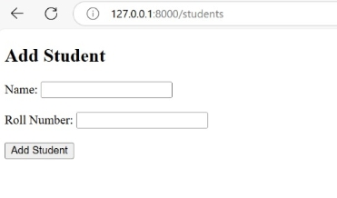
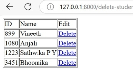
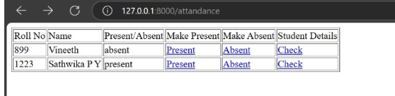
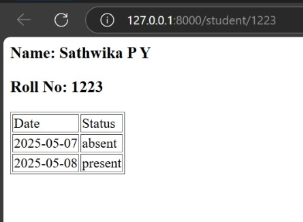

## ▫️ Project setup steps  
The instruction is to download the project from GitHub and run in local environment: 
1. Download project from Webtree Repository 
2. Extract the zipfile in C::/xampp/htdocs
3. Turn on the xampp server
4. run php artisan migrate in C::/xampp/htdocs/Webtree/student
5. Turn on the laravel server by using php artisan server
6. Open the server url in browser

# Routes and Purpose
- To add Students <br>
Route::get('/students'): Form to add Students<br>
Route::post('/students'): To add to Database<br> 
  ```
  Route::get('/students', [StudInsertController::class, 'create']);
  Route::post('/students', [StudInsertController::class, 'store'])->name('student.store');
  ```
  Image:  
 
- To delete Students  <br>
 Route::get('/delete-student'): List of Students in the delete page<br>
 Route::get('/delete/{id}): Delete students by using id<br>
  ```
    Route::get('/delete-student', [StudDeleteController::class, 'index']);
    Route::get('/delete/{id}', [StudDeleteController::class, 'destroy'])->name('student.delete');  
  ```
    Image:  
 
- To add today's Attendance Sheet<br>
Route::get('/addsheet'): To create today's Attendance Form manually<br>
  ```
    Route::get('/addsheet', [Attendance::class, 'addsheet']);
  ```
 - Attendance<br>
 Route::get('/attandance'):Today's Attendance<br>
  ```    
    Route::get('/attandance', [Attendance::class, 'attendancelist']);
  ```
- To update the Attendance<br>

  Route::get('/present/{id}): To mark status as present<br>
  Route::get('/absent/{id}):To mark status as absent<br>

    ``` Route::get('/present/{id}', [Attendance::class, 'makePresent'])->name('student.present');
        Route::get('/absent/{id}', [Attendance::class, 'makeAbsent'])->name('student.absent');
    ```
  Image:  
 
- Attendance of Particulatr Student<br>

  Route::get('/student/{id}): To get students details by using Roll Number<br>
  
      ```
        Route::get('/student/{id}', [Attendance::class, 'student'])->name('student.student');
      ```
  Image:  
 
# Bugs or Update
- Currently, we create the attendance form manually each day using the /addsheet url. By using a cron job, we can schedule this task to run automatically at a specified time.

